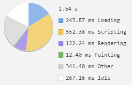
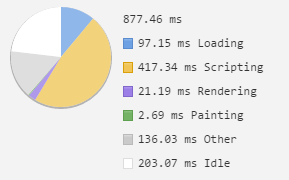

# MWB - Preformance Matters

## Week 1

###Inital timeline

Homepage

Detailpage

###Semantic HTML

Homepage

Detailpage

###Removing floats from the css

Homepage

Detailpage

###Optimizing the header img

Homepage

Detailpage

###Simplified the css selectors

Homepage

Detailpage

###Sprites VS. Inline SVG

Sprites

Inline SVG

###Changed into onepage app

Homepage

Detailpage

