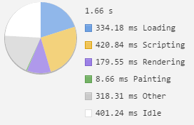
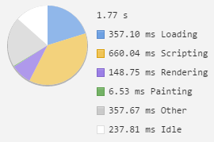
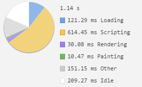
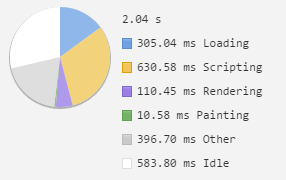
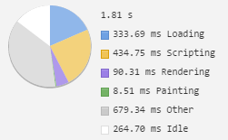

# MWB - Preformance Matters

## Week 1

###Inital timeline
Running the looklive-server without any changes. A word of warning: the results vary a lot, depending on the internet connection, the amount of tabs I had open at the time of testing and how many programs I had running at the time.

Homepage

Detailpage

###Semantic HTML
Changing div's to semantic elements such as nav's and articles. This didn't have much impact on the rendering time or precieved preformance.

Homepage

Detailpage

###Removing floats from the css
Changed floats to flexbox, again, this had barely any impact on the rendering time or the precieved preformance.

Homepage

Detailpage

###Optimizing the header img
This had by far one of the biggest impacts on the preformance of the website.

Homepage

Detailpage

###Simplified the css selectors
If things have id's you dont need to make them even more specific, ie. #one is better then article #one.

Homepage

Detailpage

###Sprites VS. Inline SVG
Tested inline SVG with a sprite sheet, Inline svg won by a tiny margin.

Sprites

Inline SVG

###Changed into onepage app
Makes the loading a little longer, but any other pages loads a ton faster.

Homepage

Detailpage

#Week 2

##Progressive Web Apps

###Wat is een Progressive Web App?
Progressive Web Apps zijn een soort combinatie tussen webpagina's en apps. Ze worden gewoon gebouwd met HTML, CSS & JS maar kan wel gebruik maken van dingen als push notifications. De gebruikers 'instaleert' de app door deze toetevoegen aan hun homescherm. Progressive Web Apps kunnen ook offline worden gebruikt en kunnen de gebruikers berichtjes sturen om hun te prikkelen de app weer te gebruiken. 

In een Progressive Web App wordt er gebruik gemaakt van Service Workers en een Manifest. Een Service worker kan de data die wordt gerequest opslaan in een lokale cache, zodat de app offline gebruikt kan worden. Het Manifest is een JSON bestand die beschrijft hoe je app heet en hoe het icoon er uitziet. Ook geeft je het controle over hoe de app zich gedraagt. Zo kan je zeggen of de app in een bepaalde orientatie moet worden gebruiker, of de URL balk zichtbaar moet zijn, ect.

###Voordelen van Progressive Web Apps
- Je kan de gebruiker push notifications sturen, net als normale apps
- Je hoeft een speciale app te programeren en zijn daarom goedkoper en makkelijker te onderhouden
- Het is nog steeds onderdeel van het web, dus kan je er gewoon naar toe linken
- Je hoeft geen rekening te houden met de voorwaarden van de Apple App Store of Google Play Store. 
- De gebruiker hoeft de app niet te updaten omdat de app op het web staat. De programmeur kan er dus voor zorgen dat de app automatisch update als de gebruiker hem opstart.

###Nadelen van Progressive Web Apps
- De gebruiker krijgt pas de download banner te zien nadat de gebruiker de website 2x heeft bezocht in twee weken. Dit is dus niet ideaal voor apps als spelletjes.
- De app staat niet in de App/Play store, waardoor de gebruiker deze moeilijker kan vinden
- Op dit moment werken Progressive Web Apps alleen op Android apparaten.
- Progressive Web Apps kunnen (nog) geen gebruik maken van de nieuwste technieken van devices. Zo kan je bijv. niet bij je adresboek of gebruik maken van de vingerafdruk sensoren.

####Bronnen
- https://developers.google.com/web/fundamentals/getting-started/your-first-progressive-web-app/?hl=en
- https://www.youtube.com/watch?v=MyQ8mtR9WxI&list=PLNYkxOF6rcICcHeQY02XLvoGL34rZFWZn&index=9
- http://developer.telerik.com/featured/what-progressive-web-apps-mean-for-the-web/
- http://www.emerce.nl/achtergrond/progressive-web-apps-de-toekomst-van-mobiele-apps
- https://developer.mozilla.org/nl/docs/Web/HTML/Applicatie_cache_gebruiken
- https://addyosmani.com/blog/getting-started-with-progressive-web-apps/

#Week 3

##Conclusion
In the end I found that optimizing just to get the loading time down is pretty pointless. Things such as acssloader, inline-css, font face observer don't neceserally cut down the loading time, but they do make the website useable sooner and thus the user thinks the page is faster. The service worked helped too, especially caching the header image. The small css changes and js changes had very little impact at all that I could barely meassure the change.

Calculating all the time the loading took was hard, since it kept changing between refreshes. That was one of the reasons I felt that optimizing for the numbers was alittle pointless since I couldn't really tell if it was helping or slowing it down.
