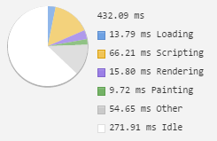

# MWB - Preformance Matters
View online: https://pm.maaikehek.nl/

## Week 1

###Inital timeline
Timeline of the orginial code.

Homepage

Detailpage

###Semantic HTML

Homepage

Detailpage

###Removing floats from the css
Changed all of the floats to flexbox

Homepage

Detailpage

###Optimizing the header img
.png to jpg, 2~mb > 262kb.

Homepage

Detailpage

###Simplified the css selectors
removed unnecessary specific css selecters, ie: body nav #logo > #logo

Homepage

Detailpage

###Sprites VS. Inline SVG
Tested sprites vs. inline svg. Difference not very noticable, but means less http-requests.

Sprites

Inline SVG

###Changed into onepage app
Initial page is a lot slower, but the detail page loads faster.

Homepage

Detailpage

#Week 2

##Progressive Web Apps

###Wat is een Progressive Web App?
Progressive Web Apps zijn een soort combinatie tussen webpagina's en apps. Ze worden gewoon gebouwd met HTML, CSS & JS maar kan wel gebruik maken van dingen als push notifications. De gebruikers 'instaleert' de app door deze toetevoegen aan hun homescherm. Progressive Web Apps kunnen ook offline worden gebruikt en kunnen de gebruikers berichtjes sturen om hun te prikkelen de app weer te gebruiken. 

In een Progressive Web App wordt er gebruik gemaakt van Service Workers en een Manifest. Een Service worker kan de data die wordt gerequest opslaan in een lokale cache, zodat de app offline gebruikt kan worden. Het Manifest is een JSON bestand die beschrijft hoe je app heet en hoe het icoon er uitziet. Ook geeft je het controle over hoe de app zich gedraagt. Zo kan je zeggen of de app in een bepaalde orientatie moet worden gebruiker, of de URL balk zichtbaar moet zijn, ect.

###Voordelen van Progressive Web Apps
- Je kan de gebruiker push notifications sturen, net als normale apps
- Je hoeft een speciale app te programeren en zijn daarom goedkoper en makkelijker te onderhouden
- Het is nog steeds onderdeel van het web, dus kan je er gewoon naar toe linken
- Je hoeft geen rekening te houden met de voorwaarden van de Apple App Store of Google Play Store. 
- De gebruiker hoeft de app niet te updaten omdat de app op het web staat. De programmeur kan er dus voor zorgen dat de app automatisch update als de gebruiker hem opstart.

###Nadelen van Progressive Web Apps
- De gebruiker krijgt pas de download banner te zien nadat de gebruiker de website 2x heeft bezocht in twee weken. Dit is dus niet ideaal voor apps als spelletjes.
- De app staat niet in de App/Play store, waardoor de gebruiker deze moeilijker kan vinden
- Op dit moment werken Progressive Web Apps alleen op Android apparaten. 
- Progressive Web Apps kunnen (nog) geen gebruik maken van de nieuwste technieken van devices. Zo kan je bijv. niet bij je adresboek of gebruik maken van de vingerafdruk sensoren. 

####Bronnen
- https://developers.google.com/web/fundamentals/getting-started/your-first-progressive-web-app/?hl=en
- https://www.youtube.com/watch?v=MyQ8mtR9WxI&list=PLNYkxOF6rcICcHeQY02XLvoGL34rZFWZn&index=9
- http://developer.telerik.com/featured/what-progressive-web-apps-mean-for-the-web/
- http://www.emerce.nl/achtergrond/progressive-web-apps-de-toekomst-van-mobiele-apps
- https://developer.mozilla.org/nl/docs/Web/HTML/Applicatie_cache_gebruiken
- https://addyosmani.com/blog/getting-started-with-progressive-web-apps/

#Week 3

##Task Managers

###Grunt

###Gulp

####Bronnen

#Timeline screenshots

##Less HTTP-requests & optimizing images
Hardly any difference noticable, since I only removed one extra call in the head (google-font). I had already merged all the JS into a single file. Also the differnce of optimized images are also not noticable, since I had already shrinked the header images and all the icons are inline. The remaining images are on a remote service and I can't optimize them. Maybe they could be served as a data-uri?

##Async web-font loading
Using [fontfaceobserver](https://github.com/bramstein/fontfaceobserver) we load the fonts async so the user can still read the content, removing the Flash of Invisible Text.

##Critical CSS
Using a [critical css generator](https://jonassebastianohlsson.com/criticalpathcssgenerator/) and [loadCSS](https://github.com/filamentgroup/loadCSS) I included the css of above the fold in the head. Makes a lot of difference on low internet speeds.

